# ☁️ Azure Hybrid Identity Lab — Microsoft Entra ID + On-Premises AD

> Extends the existing `InfoTech.com` Active Directory environment into the cloud by connecting
> the on-premises domain to **Microsoft Entra ID** (formerly Azure AD) using
> Microsoft Entra Connect — enabling hybrid identity, MFA, Conditional Access, and SSPR
> across both on-premises and cloud resources.

<div align="center">


</div>

---

## 📌 Overview

Hybrid identity is the standard for modern enterprise IT — most organisations run a
mix of on-premises Active Directory and Microsoft 365 / Azure cloud services.
This project bridges the existing `InfoTech.com` on-premises AD environment into
Microsoft Entra ID, creating a unified identity layer that spans both environments.

**What this project demonstrates:**

- Configuring Microsoft Entra Connect to sync on-premises AD users to the cloud
- Implementing cloud-based MFA and Conditional Access policies
- Enabling Self-Service Password Reset (SSPR) for domain users
- Understanding the hybrid identity architecture used in real enterprise environments
- Managing identities across on-premises and cloud from a single control plane

---

## 🏗️ Architecture

```
┌─────────────────────────────────────────────────────────────────┐
│                    Microsoft Azure (Cloud)                       │
│                                                                 │
│   ┌─────────────────────────────────────────────────────────┐  │
│   │              Microsoft Entra ID (Tenant)                 │  │
│   │                                                          │  │
│   │   Synced Users:  paula.doe, dave.doe, sue, ram.doe      │  │
│   │   MFA Policies   Conditional Access   SSPR              │  │
│   └─────────────────────────────────────────────────────────┘  │
└──────────────────────────┬──────────────────────────────────────┘
                           │ Entra Connect Sync
                           │ (HTTPS — port 443)
┌──────────────────────────┴──────────────────────────────────────┐
│                    On-Premises (VMware Lab)                      │
│                                                                 │
│   VM-WINSERV-01 (192.168.1.10) — Primary DC                    │
│   InfoTech.com Active Directory                                 │
│   Microsoft Entra Connect installed here                        │
│                                                                 │
│   VM-WINSERV-02 (192.168.1.12) — Secondary DC                  │
└─────────────────────────────────────────────────────────────────┘
```

---

## 🖥️ Environment

<table>
<tr>
<td width="50%" valign="top">

**On-Premises**
| Component | Details |
|-----------|---------|
| **Primary DC** | `VM-WINSERV-01` — `192.168.1.10` |
| **Secondary DC** | `VM-WINSERV-02` — `192.168.1.12` |
| **Domain** | `InfoTech.com` |
| **OS** | Windows Server 2025 |
| **Entra Connect** | Installed on VM-WINSERV-01 |

</td>
<td width="50%" valign="top">

**Cloud**
| Component | Details |
|-----------|---------|
| **Platform** | Microsoft Azure (Free Trial) |
| **Identity Service** | Microsoft Entra ID |
| **Sync Tool** | Microsoft Entra Connect |
| **Subscription** | Pay-As-You-Go (Free $200 credit) |
| **Tenant Domain** | `*.onmicrosoft.com` |

</td>
</tr>
</table>

---

## 📁 Repository Structure

```
azure-hybrid-identity-lab/
│
├── config/
│   ├── entra-connect-settings.md       # Entra Connect sync configuration   ✅
│   ├── conditional-access-policies.md  # Conditional Access policy setup     ⏳
│   └── sspr-config.md                  # Self-Service Password Reset config  ⏳
│
├── screenshots/
│   └── (phase screenshots added as project progresses)
│
├── docs/
│   └── runbook.md                      # Operational runbook                 ⏳
│
└── README.md
```

> ⏳ = In progress — added as the project develops

---

## 🧩 Build Progress

| #   | Phase                                             | Status      |
| --- | ------------------------------------------------- | ----------- |
| 1   | Set up Azure free trial + explore Entra ID portal | ✅ Complete |
| 2   | Prepare on-premises AD for hybrid sync            | ✅ Complete |
| 3   | Install and configure Microsoft Entra Connect     | ✅ Complete |
| 4   | Verify user sync — on-prem AD → Entra ID          | ✅ Complete |
| 5   | Configure Multi-Factor Authentication (MFA)       | ✅ Complete |
| 6   | Configure Conditional Access policies             | ⏳ Pending  |
| 7   | Configure Self-Service Password Reset (SSPR)      | ⏳ Pending  |
| 8   | Runbook + final documentation + GitHub push       | ⏳ Pending  |

---

## 🎯 What You'll Have at the End

| Capability             | Details                                               |
| ---------------------- | ----------------------------------------------------- |
| **Hybrid Identity**    | On-prem AD users synced to Entra ID                   |
| **Cloud MFA**          | Users prompted for MFA when signing into cloud apps   |
| **Conditional Access** | Policies enforcing MFA based on location/risk         |
| **SSPR**               | Users can reset their own password without calling IT |
| **Unified Admin**      | Manage identities from both AD and Entra ID portal    |

---

## ⚙️ Prerequisites

Before starting Phase 1 — confirm the following:

**On-Premises Lab:**

```powershell
# Run on VM-WINSERV-01
# Confirm AD is healthy
repadmin /replsummary

# Confirm domain is functional
Get-ADDomain | Select DNSRoot, DomainMode, PDCEmulator
```

**Azure Free Trial:**

- Sign up at `portal.azure.com` using a Microsoft account
- $200 free credit for 30 days — sufficient for this entire project
- No charges if credit is not exceeded
- Required: a valid credit card for identity verification (not charged)

---

---

# ✅ Phase 1 — Azure Free Trial Setup & Entra ID Exploration

## 📋 What This Phase Covers

Setting up the Azure environment, exploring the Microsoft Entra ID portal,
and understanding the key components before connecting anything to the
on-premises AD. Getting familiar with the portal now makes every subsequent
phase significantly easier.

---

## 🚀 Part A — Sign Up for Azure Free Trial

Go to `https://portal.azure.com` and sign in with a Microsoft account.
If you don't have one create a free account at `https://account.microsoft.com`.

**What you get with the free trial:**

| Item          | Details                                               |
| ------------- | ----------------------------------------------------- |
| Free credit   | $200 USD for 30 days                                  |
| Free services | 55+ services free for 12 months                       |
| Credit card   | Required for verification — not charged within credit |
| Entra ID      | Free tier included — sufficient for this project      |

> ⚠️ **Important:** Set a spending limit reminder. Go to
> **Cost Management → Budgets → Add** and create a $10 alert.
> This ensures you get notified well before hitting the $200 limit.

---

## 🗺️ Part B — Explore the Azure Portal Layout

Once logged in, take 10 minutes to familiarise yourself with the layout
before touching anything. This saves significant time in later phases.

```
Azure Portal (portal.azure.com)
│
├── Home
│   ├── Recent resources       ← shortcuts to things you've visited
│   ├── All services           ← full service catalogue
│   └── Dashboard              ← customisable overview
│
├── Microsoft Entra ID         ← THE main service for this project
│   ├── Overview               ← tenant info, user count, directory ID
│   ├── Users                  ← where synced users will appear
│   ├── Groups                 ← cloud groups and synced AD groups
│   ├── Devices                ← hybrid-joined devices (Phase 7)
│   ├── Applications           ← enterprise apps and SSO
│   └── Security
│       ├── Conditional Access ← policy engine (Phase 6)
│       ├── MFA                ← multi-factor auth (Phase 5)
│       └── Password reset     ← SSPR (Phase 7)
│
├── Subscriptions              ← billing and credit usage
└── Cost Management            ← monitor spend against $200 credit
```

---

## 🔍 Part C — Note Your Tenant Details

After signing in, navigate to:

```
Microsoft Entra ID → Overview
```

Note down the following — you will need these in later phases:

| Field              | Where to Find It                                   | Your Value |
| ------------------ | -------------------------------------------------- | ---------- |
| **Tenant ID**      | Entra ID → Overview → Basic Information            | Save this  |
| **Primary Domain** | Entra ID → Overview → e.g. `xxxxx.onmicrosoft.com` | Save this  |
| **Directory Name** | Top right of portal                                | Save this  |

---

## 🔍 Part D — Understand the Entra ID Free Tier

This project uses the **Entra ID Free** tier which is included in the
Azure free trial. Here's what's available and what requires a paid licence:

| Feature                       | Free Tier                   | Required For  |
| ----------------------------- | --------------------------- | ------------- |
| User sync from on-prem AD     | ✅ Included                 | Phase 3       |
| MFA (Microsoft Authenticator) | ✅ Included                 | Phase 5       |
| Self-Service Password Reset   | ✅ Included (cloud only)    | Phase 7       |
| Conditional Access            | ⚠️ Limited — basic policies | Phase 6       |
| Entra ID P1 features          | ❌ Requires licence         | Advanced CA   |
| Entra ID P2 features          | ❌ Requires licence         | Risk-based CA |

> **For this lab:** The free tier is sufficient for all phases.
> If you want to explore Conditional Access more deeply,
> you can activate a free 30-day Entra ID P2 trial within the portal.

---

## ⚙️ Part E — Verify On-Premises AD is Ready

Before any sync work begins, confirm the on-premises environment is healthy.
Run these on **VM-WINSERV-01**:

```powershell
# Check AD replication is clean
repadmin /replsummary

# Check domain functional level — needs to be Windows Server 2008 R2 or higher
Get-ADDomain | Select DNSRoot, DomainMode, PDCEmulator

# Check domain forest level
Get-ADForest | Select Name, ForestMode

# List current AD users that will be synced
Get-ADUser -Filter * -Properties EmailAddress |
    Select DisplayName, SamAccountName, UserPrincipalName, EmailAddress
```

**Expected results:**

| Check                | Expected                                |
| -------------------- | --------------------------------------- |
| Replication failures | 0                                       |
| Domain Mode          | Windows2016Domain or higher             |
| PDC Emulator         | VM-DEV-WINSERV-01                       |
| Users visible        | paula.doe, dave.doe, sue, ram.doe, etc. |

---

## ⚙️ Part F — Check UPN Suffixes on Your AD Users

This is important. When Entra Connect syncs users, it uses their
**User Principal Name (UPN)** as their cloud identity. The issue is that
`InfoTech.com` is a private domain — Azure won't be able to verify it —
so users will sync with the `onmicrosoft.com` suffix instead.

**Check current UPNs:**

```powershell
Get-ADUser -Filter * | Select DisplayName, UserPrincipalName
```

You'll likely see:

```
paula.doe@InfoTech.com
dave.doe@InfoTech.com
```

**This is fine for the lab.** When users sync to Azure, they'll appear as:

```
paula.doe@yourtenant.onmicrosoft.com
```

> If you owned a real public domain (e.g. `infotech.ca`) you could add it
> as a verified custom domain in Entra ID and users would keep their UPN.
> For this lab the `onmicrosoft.com` suffix works perfectly.

---

## ✅ Outcome

- Azure free trial active — $200 credit available ✅
- Azure Portal navigation understood ✅
- Tenant ID and primary domain noted ✅
- Entra ID Free tier confirmed sufficient for all phases ✅
- On-premises AD confirmed healthy — replication clean, users visible ✅
- UPN suffix situation understood — `onmicrosoft.com` will be used ✅
- Spending alert configured in Cost Management ✅

---

## 📸 Screenshots

<p align="center">
  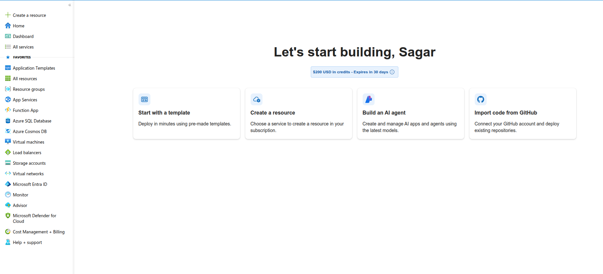
---
---
 
# ✅ Phase 2 — Prepare On-Premises AD for Hybrid Sync
 
## 📋 What This Phase Covers
 
Before installing Microsoft Entra Connect, the on-premises environment needs
to be verified and prepared. Skipping this phase causes sync errors that are
difficult to diagnose after the fact. This phase checks every prerequisite
so the Entra Connect installation in Phase 3 goes cleanly.
 
---
 
## ⚙️ Part A — Verify AD Health
 
Run on **VM-WINSERV-01** as Domain Admin:
 
```powershell
# Replication must be clean before any sync setup
repadmin /replsummary
 
# Domain and forest functional levels
Get-ADDomain | Select DNSRoot, DomainMode, PDCEmulator
Get-ADForest | Select Name, ForestMode
 
# Confirm FSMO roles are all on Server 01
netdom query fsmo
```
 
**Expected:**
 
| Check | Required |
|-------|---------|
| Replication failures | 0 / 5 on both servers |
| Domain Mode | Windows2016Domain or higher |
| Forest Mode | Windows2016Forest or higher |
| PDC Emulator | `VM-DEV-WINSERV-01` |
 
---
 
## ⚙️ Part B — Check Entra Connect Prerequisites on VM-WINSERV-01
 
Entra Connect has specific software requirements. Verify all of these
before downloading the installer:
 
```powershell
# .NET Framework version — needs 4.6.2 minimum
(Get-ItemProperty "HKLM:\SOFTWARE\Microsoft\NET Framework Setup\NDP\v4\Full").Release
 
# PowerShell version — needs 3.0 minimum
$PSVersionTable.PSVersion
 
# Windows Server version
[System.Environment]::OSVersion.Version
 
# Check TLS 1.2 is enabled (required for Azure connectivity)
[Net.ServicePointManager]::SecurityProtocol
```
 
**Minimum requirements:**
 
| Requirement | Minimum | Windows Server 2025 |
|-------------|---------|-------------------|
| .NET Framework | 4.6.2 | ✅ Included |
| PowerShell | 3.0 | ✅ 5.1 included |
| TLS | 1.2 | ✅ Enabled by default |
| OS | Server 2016 | ✅ 2025 |
 
---
 
## ⚙️ Part C — Verify Internet Connectivity from VM-WINSERV-01
 
Entra Connect communicates with Microsoft's cloud endpoints on port 443.
Confirm Server 01 can reach them:
 
```powershell
# Test connectivity to Azure AD endpoints
Test-NetConnection -ComputerName "login.microsoftonline.com" -Port 443
Test-NetConnection -ComputerName "aadcdn.msftauth.net" -Port 443
Test-NetConnection -ComputerName "graph.microsoft.com" -Port 443
```
 
**Expected — all three should return:**
```
TcpTestSucceeded : True
```
 
If any return `False` — check that the VM's network adapter is set to
**Bridged** (not NAT) and that port 443 is not blocked by a local firewall rule.
 
---
 
## ⚙️ Part D — Review AD Users Before Sync
 
Check which users exist and how they are configured — these are the
accounts that will sync to Entra ID:
 
```powershell
# List all enabled users with their UPNs
Get-ADUser -Filter {Enabled -eq $true} -Properties EmailAddress, Department |
    Select DisplayName, SamAccountName, UserPrincipalName,
           Department, EmailAddress |
    Sort-Object Department
```
 
**Accounts expected to sync:**
 
| User | UPN | Department |
|------|-----|-----------|
| Paula | `paula@InfoTech.com` | IT |
| Dave | `dave@InfoTech.com` | IT |
| Sue | `sue@InfoTech.com` | IT |
| Ram Doe | `rdoe@InfoTech.com` | IT |
| Administrator | `Administrator@InfoTech.com` | — |
 
> **Note:** When these users sync to Entra ID, their UPN will become
> `username@yourtenant.onmicrosoft.com` because `InfoTech.com` is a
> private domain that cannot be verified in Azure.
 
---
 
## ⚙️ Part E — Create a Dedicated Sync Account in AD
 
Entra Connect needs a service account in your on-premises AD to read
directory objects. Creating a dedicated account (rather than using
Administrator) is best practice:
 
```powershell
# Create the Entra Connect service account
New-ADUser `
    -Name "EntraConnectSync" `
    -SamAccountName "EntConnSync" `
    -UserPrincipalName "EntConnSync@InfoTech.com" `
    -AccountPassword (ConvertTo-SecureString "Sync@InfoTech2026!" -AsPlainText -Force) `
    -Enabled $true `
    -PasswordNeverExpires $true `
    -Description "Microsoft Entra Connect sync service account"
 
# Verify account was created
Get-ADUser -Identity "EntConnSync" | Select Name, SamAccountName, Enabled
```
 
> **Why PasswordNeverExpires?** If the sync account password expires,
> all cloud sync stops silently. In production you would use a managed
> service account (gMSA) — for this lab, PasswordNeverExpires is acceptable.
 
---
 
## ⚙️ Part F — Create a Dedicated Sync OU (Optional but Recommended)
 
By default Entra Connect syncs all OUs. Creating a dedicated OU lets you
control exactly which users sync to Azure:
 
```powershell
# Create a Sync OU under the domain root
New-ADOrganizationalUnit `
    -Name "Azure_Sync" `
    -Path "DC=InfoTech,DC=com" `
    -Description "Users in this OU sync to Microsoft Entra ID"
 
# Move the lab users into it
$syncOU = "OU=Azure_Sync,DC=InfoTech,DC=com"
 
Move-ADObject -Identity (Get-ADUser "paula.doe").DistinguishedName -TargetPath $syncOU
Move-ADObject -Identity (Get-ADUser "dave.doe").DistinguishedName -TargetPath $syncOU
Move-ADObject -Identity (Get-ADUser "sue").DistinguishedName -TargetPath $syncOU
Move-ADObject -Identity (Get-ADUser "ram.doe").DistinguishedName -TargetPath $syncOU
 — ready for SSPR in Phase 7
# Verify users are in the new OU
Get-ADUser -Filter * -SearchBase $syncOU |
    Select DisplayName, SamAccountName
```
 
---
 
## ⚙️ Part G — Final Pre-Sync Checklist
 
Run this final verification before moving to Phase 3:
 
```powershell
# Everything should come back clean
Write-Host "=== AD Health ===" -ForegroundColor Cyan
repadmin /replsummary
 
Write-Host "`n=== Domain Mode ===" -ForegroundColor Cyan
Get-ADDomain | Select DomainMode, PDCEmulator
 
Write-Host "`n=== FSMO Roles ===" -ForegroundColor Cyan
netdom query fsmo
 
Write-Host "`n=== Sync Account ===" -ForegroundColor Cyan
Get-ADUser -Identity "EntConnSync" | Select Name, Enabled
 
Write-Host "`n=== Users in Sync OU ===" -ForegroundColor Cyan
Get-ADUser -Filter * -SearchBase "OU=Azure_Sync,DC=InfoTech,DC=com" |
    Select DisplayName, UserPrincipalName
 
Write-Host "`n=== Azure Connectivity ===" -ForegroundColor Cyan
Test-NetConnection -ComputerName "login.microsoftonline.com" -Port 443 |
    Select ComputerName, TcpTestSucceeded
```
 
---
 
## ✅ Outcome
 
- AD replication confirmed clean — 0 failures on both DCs ✅
- Domain functional level confirmed Windows2016Domain or higher ✅
- All Entra Connect prerequisites met on VM-WINSERV-01 ✅
- Outbound connectivity to Microsoft endpoints confirmed ✅
- AD users reviewed — 4 accounts ready for sync ✅
- Dedicated sync service account `EntConnSync` created ✅
- `Azure_Sync` OU created — users moved in for controlled sync ✅
---
 
## 📸 Screenshots
 
<p align="center">
   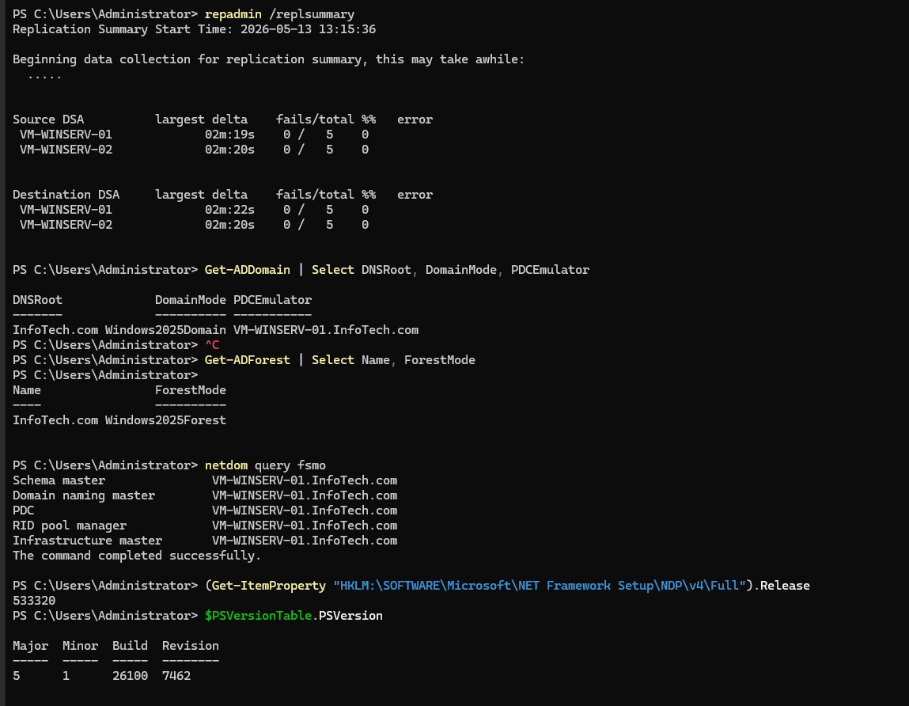
   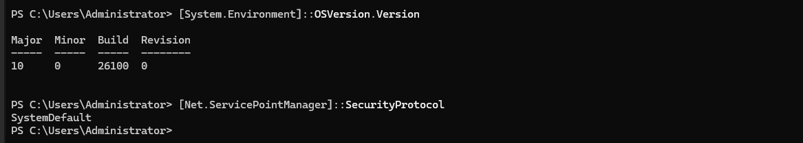
</p>
<p align="center">
  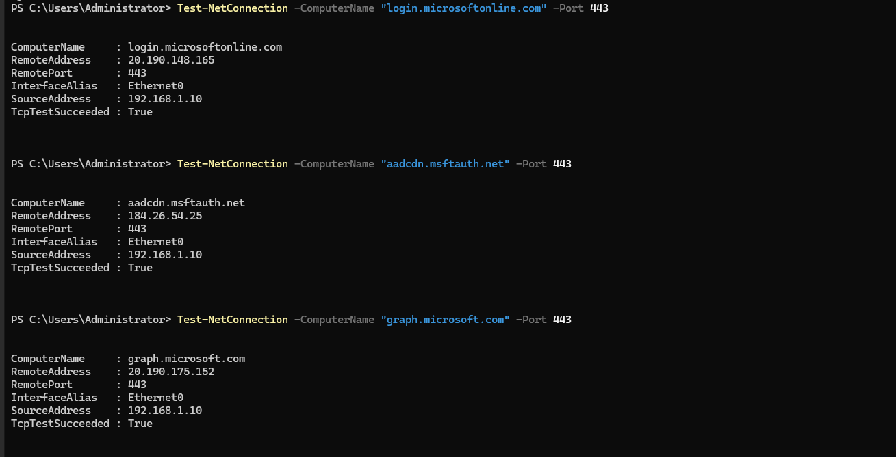
   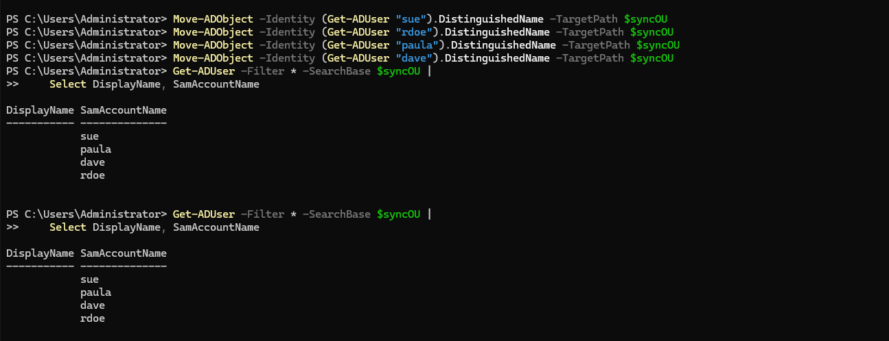
</p>
<p align="center">
  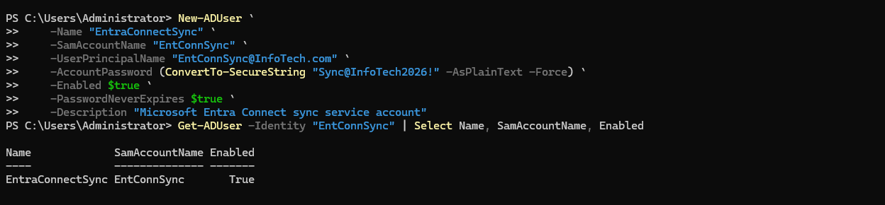
</p>
---

---

# ✅ Phase 3 — Install Microsoft Entra Connect

## 📋 What This Phase Covers

Microsoft Entra Connect (formerly Azure AD Connect) is the bridge between
your on-premises `InfoTech.com` Active Directory and Microsoft Entra ID in
the cloud. It runs as a service on `VM-WINSERV-01` and continuously syncs
user identities in one direction — on-prem to cloud.

> Full configuration reference: [`config/entra-connect-settings.md`](config/entra-connect-settings.md)

---

## 🔍 How Entra Connect Works

```
VM-WINSERV-01 (on-premises)           Microsoft Azure (cloud)
────────────────────────────           ──────────────────────
Active Directory                       Microsoft Entra ID
  paula@InfoTech.com    ──sync──►  paula@tenant.onmicrosoft.com
  dave@InfoTech.com     ──sync──►  dave@tenant.onmicrosoft.com
  sue@InfoTech.com      ──sync──►  sue@tenant.onmicrosoft.com
  rdoe@InfoTech.com     ──sync──►  rdoe@tenant.onmicrosoft.com

Sync interval: every 30 minutes (default)
Direction:     one-way — on-prem → cloud only
Protocol:      HTTPS outbound on port 443
```

---

## 🚀 Installation Steps

### Part A — Download Entra Connect on VM-WINSERV-01

Open a browser on **VM-WINSERV-01** and download directly from Microsoft:

```
https://www.microsoft.com/en-us/download/details.aspx?id=47594
```

Or download via PowerShell:

```powershell
# Download Microsoft Entra Connect installer
Invoke-WebRequest `
    -Uri "https://download.microsoft.com/download/B/0/0/B00291D0-5A83-4DE7-86F5-980BC00DE05A/AzureADConnect.msi" `
    -OutFile "C:\Temp\AzureADConnect.msi"
```

---

### Part B — Run the Installer

Double-click `AzureADConnect.msi` → the setup wizard opens.

**Screen 1 — Welcome**

- Check **"I agree to the license terms"**
- Click **Continue**
  **Screen 2 — Express Settings vs Custom**

Choose **Customize** — not Express. Express uses the Administrator account
which is not best practice. Custom lets us use the `EntConnSync` account
we created in Phase 2.

---

### Part C — Configure in the Wizard

**Step 1 — Install required components**

Leave all defaults — click **Install**

**Step 2 — User sign-in method**

Select **Password Hash Synchronization** — this is the simplest and most
common method. It syncs a hash of the password hash so users can authenticate
to cloud apps using their on-prem password.

| Sign-in Method            | Description                  | Use Case                    |
| ------------------------- | ---------------------------- | --------------------------- |
| **Password Hash Sync** ✅ | Syncs password hash to cloud | Simplest — best for lab     |
| Pass-through Auth         | Auth stays on-prem           | No password stored in cloud |
| Federation (ADFS)         | Full federation server       | Complex enterprise setups   |

**Step 3 — Connect to Microsoft Entra ID**

Enter your **Azure Global Admin** credentials:

```
Username: youradmin@yourtenant.onmicrosoft.com
Password: your Azure portal password
```

**Step 4 — Connect your on-premises directories**

- Click **Add Directory**
- Forest: `InfoTech.com` should auto-detect
- Select **Create new AD account**
- Enter Domain Admin credentials for `InfoTech.com`
- Click **OK**
  **Step 5 — Azure AD sign-in configuration**

You'll see a warning:

```
⚠️ Users will not be able to sign in to Azure AD with
on-premises credentials if the UPN suffix does not match
a verified domain.
```

This is expected — `InfoTech.com` is not a verified domain in Azure.
Check **"Continue without matching all UPN suffixes to verified domains"**

**Step 6 — Domain and OU filtering**

Select **Sync selected domains and OUs** → expand `InfoTech.com` →
uncheck everything → check only `Azure_Sync` OU

This ensures ONLY the four lab users sync — not service accounts,
disabled accounts, or system objects.

**Step 7 — Identifying users**

Leave defaults:

- Users are represented only once across all directories ✅
- Let Azure manage the source anchor ✅
  **Step 8 — Filter users and devices**

Leave as **Synchronize all users and devices** — the OU filter
from Step 6 already handles scope.

**Step 9 — Optional features**

Enable:

- ✅ **Password hash synchronization**
- ✅ **Password writeback** _(needed for SSPR in Phase 7)_
- Leave others unchecked for now
  **Step 10 — Ready to configure**

Confirm:

- ✅ Start the synchronization process when configuration completes
- Click **Install**

---

### Part D — Verify the Service is Running

```powershell
# Check Entra Connect sync service is running
Get-Service -Name "ADSync"

# Check the sync scheduler is active
Import-Module ADSync
Get-ADSyncScheduler
```

**Expected:**

```
Status   Name     DisplayName
──────   ────     ───────────
Running  ADSync   Microsoft Azure AD Sync

AllowedSyncCycleInterval : 00:30:00
CurrentlyRunning         : False
NextSyncCyclePolicyType  : Delta
SyncCycleEnabled         : True
```

---

### Part E — Trigger the First Manual Sync

Don't wait 30 minutes — force the first sync immediately:

```powershell
Import-Module ADSync

# Run a full initial sync
Start-ADSyncSyncCycle -PolicyType Initial

# Monitor sync progress
Get-ADSyncConnectorStatistics -ConnectorName "InfoTech.com"
```

The initial sync typically takes 1–3 minutes for a small directory.

---

### Part F — Verify Sync in Azure Portal

Open a browser and navigate to:

```
https://portal.azure.com → Microsoft Entra ID → Users
```

You should see your four on-premises users now appearing with
**Source: Windows Server AD**:

| User      | Cloud UPN                              | Source            |
| --------- | -------------------------------------- | ----------------- |
| Paula Doe | `paula.doe@yourtenant.onmicrosoft.com` | Windows Server AD |
| Dave Doe  | `dave.doe@yourtenant.onmicrosoft.com`  | Windows Server AD |
| Sue       | `sue@yourtenant.onmicrosoft.com`       | Windows Server AD |
| Ram Doe   | `ram.doe@yourtenant.onmicrosoft.com`   | Windows Server AD |

---

## 🔧 Troubleshooting

| Issue                           | Check                       | Fix                                             |
| ------------------------------- | --------------------------- | ----------------------------------------------- |
| Users not appearing in Azure    | `Get-ADSyncScheduler`       | Run `Start-ADSyncSyncCycle -PolicyType Initial` |
| Sync service not starting       | Event Viewer → Application  | Check `EntConnSync` account credentials         |
| UPN mismatch warning            | Expected for private domain | Accept and continue — lab behaviour             |
| Connectivity error during setup | Port 443 blocked            | Run Part C connectivity tests from Phase 2      |
| "Access denied" on AD directory | Wrong credentials           | Use Domain Admin credentials for InfoTech.com   |

---

## ✅ Outcome

- Microsoft Entra Connect downloaded and installed on `VM-WINSERV-01` ✅
- Password Hash Synchronization configured ✅
- Sync scoped to `Azure_Sync` OU only — 4 users ✅
- `ADSync` service running and confirmed active ✅
- First manual sync completed successfully ✅
- All 4 users visible in Entra ID portal as **Windows Server AD** source ✅
- Password writeback enabled ✅

---

## 📸 Screenshots

<p align="center">
   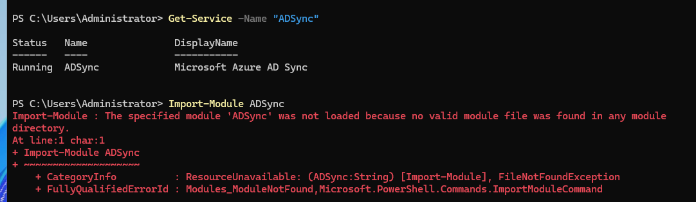
   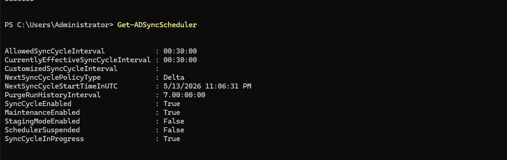
</p>
<p align="center">
  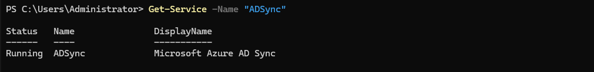
  
</p>
---

---

# ✅ Phase 4 — Verify Hybrid Identity Sync

## 📋 What This Phase Covers

With Entra Connect installed and the first sync completed, this phase
verifies that everything is working correctly — from both sides. Users
are checked in the Azure Portal, attributes are confirmed, sync health
is validated, and a test sign-in confirms the hybrid identity is fully
functional end to end.

---

## 🔍 Part A — Verify Users in Azure Portal

Navigate to:

```
https://portal.azure.com → Microsoft Entra ID → Users → All Users
```

You should see your four synced users alongside the cloud admin account.
Look for the **On-premises sync enabled** column showing **Yes**:

| Display Name | UPN                                | On-Premises Sync | Source            |
| ------------ | ---------------------------------- | ---------------- | ----------------- |
| Paula        | `paula@yourtenant.onmicrosoft.com` | Yes              | Windows Server AD |
| Dave         | `dave@yourtenant.onmicrosoft.com`  | Yes              | Windows Server AD |
| Sue          | `sue@yourtenant.onmicrosoft.com`   | Yes              | Windows Server AD |
| Ram          | `rdoe@yourtenant.onmicrosoft.com`  | Yes              | Windows Server AD |

Click on **Paula Doe** → confirm these attributes synced correctly:

| Attribute       | Expected Value       |
| --------------- | -------------------- |
| Department      | IT                   |
| Job Title       | Senior Agent         |
| On-premises UPN | `paula@InfoTech.com` |
| Source          | Windows Server AD    |
| Account enabled | Yes                  |

---

## 🔍 Part B — Verify Sync Health from VM-WINSERV-01

```powershell
# Import the ADSync module
Import-Module "C:\Program Files\Microsoft Azure AD Sync\Bin\ADSync\ADSync.psd1"

# Check sync scheduler — SyncCycleEnabled must be True
Get-ADSyncScheduler | Select SyncCycleEnabled, NextSyncCyclePolicyType, `
    NextSyncCycleStartTimeInUTC, LastSyncRunStatus

# Check connector statistics
Get-ADSyncConnectorStatistics -ConnectorName "InfoTech.com"

# Check for any sync errors on objects
Get-ADSyncCSObject -ConnectorName "InfoTech.com" |
    Where-Object { $_.HasSyncError -eq $true } |
    Select DisplayName, SyncError
```

**Expected:**

```
SyncCycleEnabled     : True
NextSyncCyclePolicyType : Delta
LastSyncRunStatus    : Success
```

---

## 🔍 Part C — Check Sync Errors

```powershell
# Check for any objects that failed to sync
$errors = Get-ADSyncCSObject -ConnectorName "InfoTech.com" |
    Where-Object { $_.HasSyncError -eq $true }

if ($errors) {
    $errors | Select DisplayName, SyncError
} else {
    Write-Host "No sync errors — all objects synced cleanly" -ForegroundColor Green
}
```

If any users show a sync error — the most common causes are:

| Error                        | Cause                   | Fix                                           |
| ---------------------------- | ----------------------- | --------------------------------------------- |
| `AttributeValueMustBeUnique` | Duplicate UPN or email  | Fix the duplicate in AD, run delta sync       |
| `InvalidSoftMatch`           | UPN mismatch            | Expected for InfoTech.com — not an error      |
| `ExportErrorNotRetried`      | Transient network error | Run `Start-ADSyncSyncCycle -PolicyType Delta` |

---

## 🔍 Part D — Verify Password Hash Sync

Confirm that password hashes are syncing — this is what allows
users to authenticate to cloud apps with their on-prem password:

```powershell
# Check Password Hash Sync status
Get-ADSyncAADPasswordSyncState
```

**Expected:**

```
PasswordSyncState : Enabled
LastSuccessfulSync : {recent timestamp}
```

In the Azure Portal, also check:

```
Microsoft Entra ID → Overview → Password hash sync status: Enabled
```

---

## 🔍 Part E — Test User Sign-In to Microsoft 365

This is the end-to-end test — confirming a synced on-premises user
can actually sign into a cloud application.

Open a browser in **InPrivate / Incognito mode** and go to:

```
https://myapps.microsoft.com
```

Sign in as one of the synced users:

```
Username: paula.doe@yourtenant.onmicrosoft.com
Password: paula.doe's on-premises AD password
```

**Expected:** My Apps portal loads — user is authenticated ✅

If sign-in fails with "incorrect password" — the password hash
hasn't synced yet. Force it:

```powershell
# Force password hash sync
Import-Module "C:\Program Files\Microsoft Azure AD Sync\Bin\ADSync\ADSync.psd1"
Invoke-ADSyncRunProfile -ConnectorName "yourtenant.onmicrosoft.com" `
    -RunProfileName "Export"
Start-ADSyncSyncCycle -PolicyType Delta
```

---

## 🔍 Part F — Verify Sync in Entra Connect Health (Optional)

In the Azure Portal:

```
Microsoft Entra ID → Microsoft Entra Connect → Connect sync
```

This shows:

- Last sync time
- Sync status (Healthy / Error)
- Number of objects synced
- Any pending errors
  A green **Healthy** status with a recent sync time confirms everything
  is working correctly.

---

## ⚙️ Useful Sync Management Commands

```powershell
Import-Module "C:\Program Files\Microsoft Azure AD Sync\Bin\ADSync\ADSync.psd1"

Write-Host "=== Sync Service ===" -ForegroundColor Cyan
Get-Service -Name "ADSync" | Select Status, Name

Write-Host "`n=== Connector Run Status ===" -ForegroundColor Cyan
Get-ADSyncConnectorRunStatus

Write-Host "`n=== Last 5 Sync Results ===" -ForegroundColor Cyan
Get-ADSyncRunProfileResult | Select-Object -First 5 |
    Select StartDate, RunProfileName, Result

Write-Host "`n=== Scheduler ===" -ForegroundColor Cyan
Get-ADSyncScheduler | Select SyncCycleEnabled, NextSyncCyclePolicyTypea
```

---

## ✅ Outcome

- All 4 users confirmed visible in Entra ID with **Windows Server AD** source ✅
- User attributes (Department, Job Title) confirmed synced correctly ✅
- Sync scheduler confirmed enabled — running every 30 minutes ✅
- No sync errors detected ✅
- Password Hash Synchronization confirmed active ✅
- Test sign-in to `myapps.microsoft.com` successful with on-prem credentials ✅

---

## 📸 Screenshots

<p align="center">
   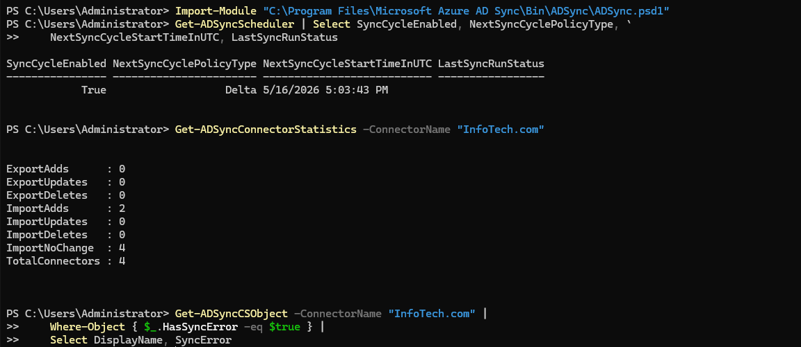
   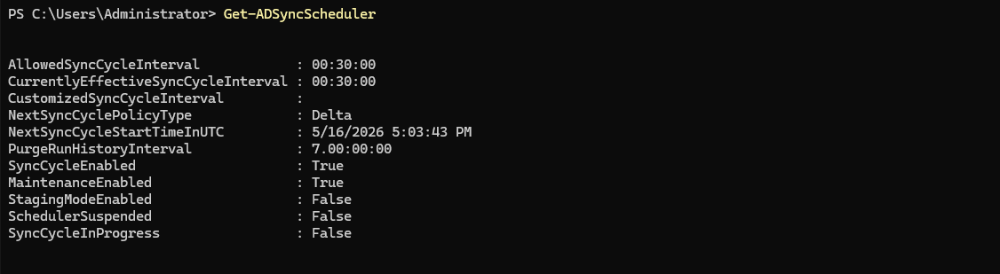
</p>
<p align="center">
  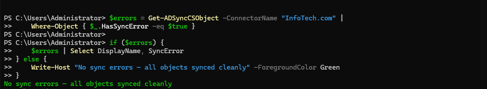
  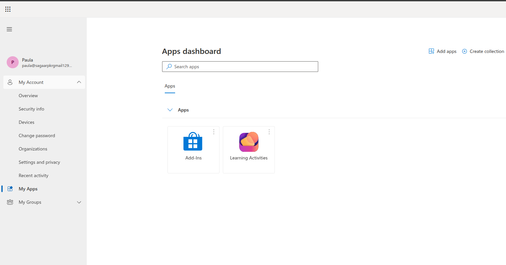
  
</p>
---

# ✅ Phase 5 — Configure Multi-Factor Authentication (MFA)

## 📋 What This Phase Covers

MFA adds a second verification step when users sign into cloud applications —
even if someone has the correct password, they still need to approve the
sign-in on their phone or enter a one-time code. This phase enables MFA
for the synced InfoTech.com users and tests it end to end.

---

## 🔍 How MFA Works in Entra ID

```
User enters username + password
              │
              ▼
Entra ID validates credentials ✅
              │
              ▼
MFA challenge triggered
              │
        ┌─────┴──────────────────────┐
        ▼                            ▼
Microsoft Authenticator App    One-time SMS code
"Approve sign-in?" → Approve   Enter 6-digit code
        │                            │
        └─────────────┬──────────────┘
                      ▼
              Access granted ✅
```

---

## ⚙️ Part A — Enable Security Defaults (Quickest MFA Method)

Security Defaults is Microsoft's free baseline MFA policy that
requires all users to register for MFA. This is the simplest
approach for the free tier and doesn't require Entra ID P1.

Navigate to:

```
portal.azure.com
→ Microsoft Entra ID
→ Overview
→ Properties (bottom of left sidebar)
→ Manage Security Defaults (at the bottom of the page)
```

Toggle **Security Defaults** to **Enabled** → Save.

**What Security Defaults enforces:**
| Policy | Effect |
|--------|--------|
| All users must register for MFA | Within 14 days of first sign-in |
| Admins always require MFA | On every sign-in |
| Block legacy authentication | Blocks basic auth protocols |
| MFA required for Azure management | Always |

> **Note:** Security Defaults and Conditional Access cannot run at the same time.
> Since the free tier doesn't include full Conditional Access, Security Defaults
> is the correct choice for this lab.

---

## ⚙️ Part B — Register MFA Method for a User

After enabling Security Defaults, test the MFA registration flow with Paula:

**Option 1 — Microsoft Authenticator App (Recommended)**

On your phone:

1. Download **Microsoft Authenticator** from App Store / Google Play
2. Open an InPrivate browser → go to `https://myapps.microsoft.com`
3. Sign in as `paula@sagaarpkrgmail129.onmicrosoft.com`
4. You will be prompted: **"More information required"** → click Next
5. Follow the wizard to scan the QR code with the Authenticator app
6. Approve the test notification → registration complete
   **Option 2 — One-Time Passcode via Email or SMS**

```
https://aka.ms/mfasetup
→ Sign in as paula@sagaarpkrgmail129.onmicrosoft.com
→ Add sign-in method → choose Phone or Email
→ Enter phone number or email → verify the code
```

---

## ⚙️ Part C — Enable Per-User MFA (Alternative to Security Defaults)

If you want more granular control — enabling MFA per user instead
of for everyone:

```
portal.azure.com
→ Microsoft Entra ID
→ Users → All Users
→ Per-user MFA (top menu bar)
```

Select Paula Doe → click **Enable** under Quick Steps.

Repeat for Dave, Sue, and Ram.

| User    | MFA Status |
| ------- | ---------- |
| Paula   | Enabled    |
| Dave    | Enabled    |
| Sue     | Enabled    |
| Ram Doe | Enabled    |

---

## ⚙️ Part D — Test MFA End to End

Open an InPrivate browser and sign in:

```
https://myapps.microsoft.com
Username: paula@sagaarpkrgmail129.onmicrosoft.com
Password: *********
```

**Expected flow:**

```
1. Enter username and password ✅
2. MFA challenge appears
   → "Approve sign-in?" notification on Authenticator app
   → OR enter 6-digit code
3. Approve / enter code ✅
4. My Apps portal loads ✅
```

If MFA fires and the user gets in after approving — Phase 5 is complete.

---

## ⚙️ Part E — View MFA Registration Status in Portal

Check which users have registered their MFA method:

```
portal.azure.com
→ Microsoft Entra ID
→ Security
→ Authentication Methods
→ User Registration Details
```

This shows:

| User      | MFA Registered | Method                  |
| --------- | -------------- | ----------------------- |
| Paula Doe | Yes            | Microsoft Authenticator |
| Dave Doe  | No             | — (pending)             |
| Sue       | No             | — (pending)             |
| Ram Doe   | No             | — (pending)             |

> Users who haven't registered will be prompted on their next sign-in
> and have 14 days to complete registration before being blocked.

---

## ✅ Outcome

- Security Defaults enabled — MFA required for all users ✅
- Microsoft Authenticator registered for Paula Doe ✅
- MFA challenge confirmed firing on sign-in ✅
- Test sign-in successful after MFA approval ✅
- MFA registration status visible in Authentication Methods portal ✅

---
